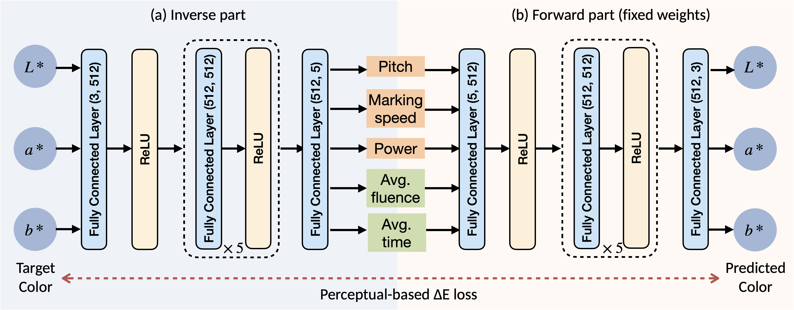
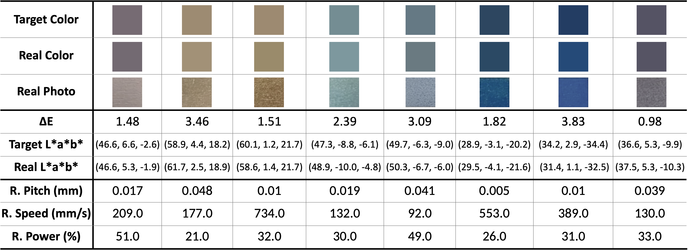

## **PD-TNN: Physics-Driven Tandem Neural Network for Color Prediction in Laser-Induced Thin Films**  

This repository contains the official implementation of **PD-TNN**, a physics-driven tandem neural network for inverse color prediction in laser-induced thin films. PD-TNN integrates physics-based knowledge and perceptual loss to enhance inverse design accuracy.  

👨‍💻 **Authors**: Yun-Jie Jhang, Tsung-Ming Tai, Chia-Hung Chou, Wisarud Yongbanjerd, Pin-Han Huang, Hung-Wen Chen  

---

## **Dataset**  

The dataset used in this study consists of **2428 experimental data points** collected from laser processing on titanium thin films. It includes three machining parameters (**pitch, marking speed, laser power**) and two physics-driven features (**average fluence F and average time τ**).  

⚠️ **Data Availability**  
Due to privacy constraints, the dataset is not publicly available. However, it can be obtained from the corresponding author upon reasonable request, as stated in our paper:  

> *The data that support the findings of this study are available from the corresponding author upon reasonable request.*  

---

## **Usage**  

### **Training the Forward Model**  
To train the forward model, which maps machining parameters to color outputs, open `training_forward.ipynb` in Jupyter Notebook or Google Colab and run the cells.  

### **Training the Inverse Model (PD-TNN)**  
To train the PD-TNN inverse model, which predicts laser parameters for a target color, open `training_tandem.ipynb` in Jupyter Notebook or Google Colab and run the cells.  

---

## **Model Architecture**  

  

PD-TNN consists of two interconnected neural networks:  

- **Forward Model**: Map machining parameters and physics-driven features to CIE L\*a\*b\* color outputs.  
- **Inverse Model**: Predict machining parameters given a target color, leveraging physics-based knowledge to improve performance.  

🔹 **Key Innovations**:  
✔ **Physics-driven inputs** (average fluence and time per unit area) to mitigate the one-to-many mapping issue.  
✔ **Perceptual loss function** using **ΔE** to align predictions with human visual perception.  
✔ **Robust color prediction** with a mean test **ΔE of 1.48**, achieving **74% within Just Noticeable Difference (JND, ΔE ≤ 2.3)** and **97% within acceptable industrial thresholds (ΔE ≤ 7)**.  

---

## **Results**  

We use **ΔE** as the evaluation metric, which measures perceptual color differences. The lower the **ΔE**, the more accurate the predicted color. 

### **Ablation Study on PD-TNN**

This table presents an ablation study on the full PD-TNN framework, evaluating how physics-driven features and loss functions affect color prediction accuracy, measured by average **ΔE**. The best performance is highlighted in bold.  

| Loss  | MP only | W/ **F** | W/ **τ** | W/ **F** & **τ** |
|-------|--------|---------|---------|--------------|
| **MSE**  | 5.43   | 5.91    | 4.60    | 3.03         |
| **ΔE**   | 3.55   | 4.21    | 3.51    | **1.48**    |

### Real-world Implementation

PD-TNN successfully translated target digital colors into **real-world laser coloration on titanium**.  

  

---

## **License**  

This project is licensed under the **MIT License**. See the [LICENSE](LICENSE) file for details.  
